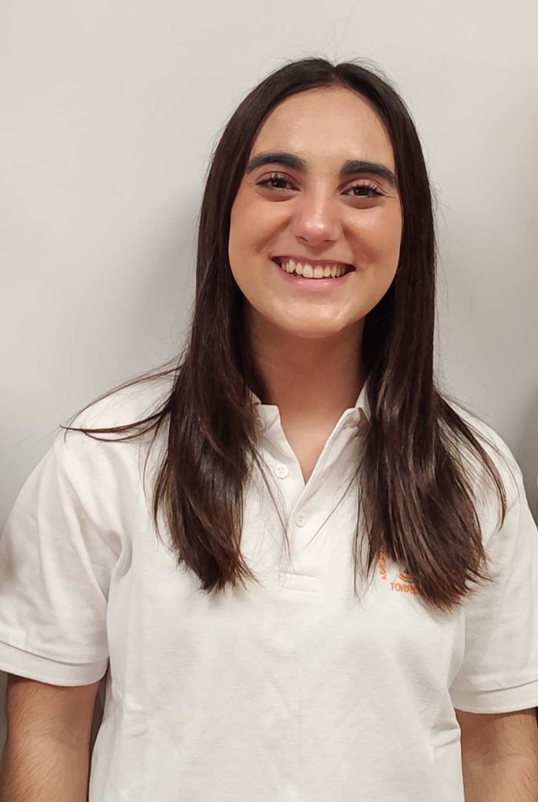
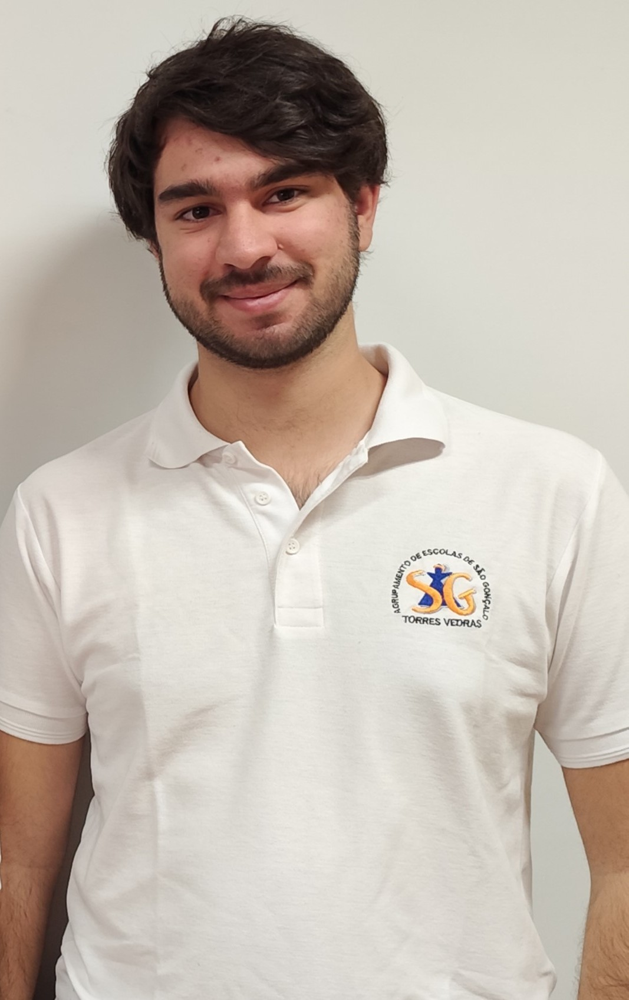

# Robotics Club (São Gonçalo School)

|  | This repository contains the documentation for the São Gonçalo School team's robot for the 2025 World Robot Olympiad Future Engineers competition. The robot was designed and built by a team of two students and the help of the coach. If you would like to learn more about our club, please visit our [website](https://robotica.ag-sg.net/). |
| ------------------------------------------------ | ---------------------------------------------------------------------------------------------------------------------------------------------------------------------------------------------------------------------------------------------------------------------------------------------------------------------------------------------------- |
 
# The Team

## Joana Silva
|  |  Age: 18  High School: Madeira Torres, Torres Vedras, Lisboa, Portugal   Description: Hi, I'm Joana from Portugal and this is my fourth season of WRO. I've participated in this category before, but as I find it extremely challenging, there's always something to improve on. I've enjoyed challenges ever since I was little and this is another one that connects what I love: programming and robotics. |
| ------------------------------ | ----------------------------------------------------------------------------------------------------------------------------------------------------------------------------------------------------------------------------------------------------------------------------------------------------------------------------------------------------------------------------------------------------------------------- |

## Simão Freire
|  | Age: 20  University: Instituito Superior de Engenharia de Lisboa, Lisboa, Portugal   Description: Hi! My name is Simão and ever since I was a kid, I've been interested in computers and how they work, that led me to the path of wanting to learn more about programming and so I joined the robotics club of my school. This will be my third season in WRO and I'm really looking forward to it! |
| ------------------------------ | ---------------------------------------------------------------------------------------------------------------------------------------------------------------------------------------------------------------------------------------------------------------------------------------------------------------------------------------------------------------------------------------------------------- |

## Tiago Severino (Coach)

Role: Coach

Description: I’m hardworking, goal-oriented young man. Challenges captivate me and the harder they are, the better. Overcoming limits gives me a special taste, realizing how far I can go. I’ve already taken part in robotics competitions and now I’m leading a team with the aim of teaching what I’ve learned from my experience. I believe that the only way to get where you want to go is to never stop trying and never give until up you reach the end goal.

## Team Photo

# The Challenge
The [WRO 2025 Future Engineers - Self-Driving Cars](https://wro-association.org/) challenge invites teams to plan, build and program a robotic vehicle capable of driving autonomously on a track that changes dynamically with each round, having to be prepared for any option. The competition consists of two races: the first “Open Challenge” where the objective is to complete three laps in the direction decided before the race and stop where it started and the second “Obstacle Challenge” where the vehicle must complete 3 laps while overcoming random obstacles depending on their color and successfully perform a precise parallel parking maneuver. Teams must integrate advanced robotics concepts such as computer vision, sensor fusion and kinematics, focusing on innovation and reliability.

This challenge puts all aspects of the engineering process into practice, including:
* Mobility management: Developing efficient mechanisms for moving vehicles.
* Obstacle handling: Defining strategies to detect and navigate traffic signs (red and green markers) within specified rules.
* Parking: Creating parallel parking strategies to meet all the requirements.
* Documentation: Present engineering progress, design decisions and open source collaboration via a public GitHub repository.
  
Points are awarded based on performance in the challenge rounds, the quality of the engineering documentation and the ability to create an innovative and robust solution. The aim is to inspire learning through real-world applications of robotics and teamwork to create creative problem-solving.

Learn more about the challenge [here](https://wro-association.org/wp-content/uploads/WRO-2025-Future-Engineers-Self-Driving-Cars-General-Rules.pdf).

# Our Robot

Vídeo of the obstacle challenge in youtube [here](https://youtu.be/YTKn1OeHEFA)

# Strategy
For the WRO 2025 Future Engineers challenge, our strategy focuses on achieving an optimal balance between accuracy and speed, in order to complete the trial as flawlessly as possible.

For the Open Challenge, we chose to use sonar sensors to detect the outer walls, combined with a digital compass to maintain a stable trajectory. This approach allows us to perform precise turns and ensure consistent navigation.

For the Obstacle Challenge, we implemented an integrated system that combines a camera, sonar sensors, and a digital compass, ensuring safe and efficient navigation.
We structured the trial into three phases:

* First lap – The robot pauses briefly at the beginning and middle of each straight section to identify potential obstacles. During this time, it performs wider and slower turns, giving the camera sufficient time to correctly detect and classify obstacles.

* Second and third laps – After completing the first lap, the robot has already memorized the position and color of each obstacle. This prevents the need for repeated processing, allowing for faster, more efficient, and fully autonomous navigation.

* Parking – At the end of the three laps, the robot approaches the outer wall to detect the parking area using the sonar sensor. Once the wall is detected, the robot executes a controlled parallel parking maneuver, meeting all the required evaluation criteria.

# Mobility Management
The robot's mobility is managed by a combination of components, including  the powertrain (motor + encoder + drivetrain), steering system, and chassis. The size of the robot chassis was designed for optimal maneuverability, allowing it to make sharp turns and navigate tight spaces effectively. 

## Drivetrain
For optimal performance, it is essential that the robot maintains good stability. To achieve this, we implemented a differential drive system, which allows the torque generated by the motor to be distributed between the wheels, enabling them to rotate at different speeds.

To obtain smoother turns, we integrated axles that transmit power directly to the wheels. In order to better meet our specific requirements, we designed and built our own transmission system using a combination of a gearbox and 3D-printed gears. We employed planetary gears and machined the axles on a lathe to precisely fit the bearings that connect to the wheels.

### Potential Improvements:
 - Swap our printed gears with metal based ones to improve durability

## Motor

<table>
  <tr>
    <td width="50%" style="text-align: left;">
      
    </td>
    <td width="50%" style="text-align: left; vertical-align: top;">
      <h3>Specifications:</h3>
      <li>Voltage: 12V</li>
      <li>Gear Ratio: </li>
      <li>Speed: </li>
      <li>Torque: </li>
      <li>Weight: </li>
      </li>
    </td>
  </tr>
</table>

After evaluating different motors, we decided to use a ______. This motor was selected based on its rotations per second and its lightweight, compact design, which stands out compared to other motors with similar performance. The motor was mounted to the chassis using a custom holder and enclosed in a 3D-printed casing that integrates all components within it.

Where to buy the motor: [Link](https://www.example.com)

## Encoder
The encoder is used to measure the distance traveled by the robot, allowing for precise navigation and obstacle avoidance. It is connected to the motor and provides feedback on the robot's position. We opted to use a N20 **magnetic encoder** as it provides greater precision than its optical counterpart.

Where to find the encoder: [Link](https://www.example.com)

# Steering Mechanism
After experimenting with various steering mechanisms, we evaluated their advantages and disadvantages. Ultimately, we opted for a link-based steering system driven by a servo motor, similar to a simplified Ackermann steering configuration. This decision was made to select the simplest, lightest, most compact, and efficient mechanism, providing an effective steering angle without compromising the robot’s small size and low weight.

We chose a steering system based on metal components and fully custom 3D-printed parts designed by ourselves. This approach allowed us to enhance overall performance by tailoring the system to our specific requirements. Compared to last year, we made this mechanism more robust, offering greater flexibility in terms of design and implementation.

The steering system consists of two symmetrical wheel mounts connected by a steel steering arm, which in turn is linked to the servo motor. This setup enables precise and synchronized wheel steering, essential for stable turns during navigation and parking maneuvers.

### Potential Improvements:
....

....

## Servo Motor
For steering, we selected the ______ servo motor, favoring it for its high torque and swift response.

Where to buy the servo motor: 

### Potential Improvements:
....

....

## Chassis
Our previous attempts to design a robot for the Future Engineers category resulted in bulky and heavy robots, which proved detrimental for navigating narrow corridors and making tight turns. This year, our goal was to create a more compact and lightweight robot. We achieved this by using a chassis planned and designed in the Onshape application, ensuring a precise structure. Consequently, we opted to produce an almost entirely 3D-printed robot.

We also decided to create a tall upper structure where the compass is mounted, fitting into the camera support. This implementation became necessary because we had to address issues caused by magnetic field interference. By elevating the surface where the compass is fixed, we were able to reduce these interferences.

The chassis houses all components. We started with the lower part, which accommodates the rear differential and the front servo motor. Then, we built three levels: the first for the battery, the second for ________, and the third for the required circuit boards. Additionally, the robot includes a front-mounted camera and four ultrasonic sensors positioned on the sides, front, and rear of the robot.

### Potential Improvements:
....

....

# Power and Sense Management
The robot’s power management and sensor system is composed of several components, including a repurposed battery, a Raspberry Pi 5, Raspberry Pi Pico and a module camera. These components work together to provide the robot with the necessary power and sensory data to navigate its environment efficiently.

## Battery

Where to buy the battery: link

The battery is mounted on one of the robot’s levels in order to optimize space while remaining securely fixed. In addition, we implemented a battery level indicator to monitor power consumption and remaining charge.

### Potential Improvements:

Consider using a higher-capacity battery to extend operating time without significantly increasing weight.

Add a Battery Management System (BMS) for greater safety during charging and discharging.

## Raspberry Pi 5	

### Potential Improvements:

## Raspberry Pi Pico

### Potential Improvements:

## Camera Module

### Potential Improvements:

# Cost Report 

## Components

<table border="1" cellspacing="0" cellpadding="8">
  <thead>
    <tr>
      <th>Component</th><th>Quantity</th><th>Cost per Unit (€)</th><th>Total (€)</th>
    </tr>
  </thead>
  <tbody>
    <tr>
      <td>Raspberry Pi 5</td> <td>1</td> <td>89.99€</td> <td>89.99€</td>
    </tr>
    <tr>
      <td>Raspberry Pi Pico</td> <td>1</td> <td>4.99€</td> <td>4.99€</td>
    </tr>
    <tr>
      <td>Camera Module</td> <td>1</td> <td>35.99€</td> <td>35.99€</td>
    </tr>
    <tr>
      <td>Servo Motor</td> <td>1</td> <td>5.66€</td> <td>5.66€</td>
    </tr>
    <tr>
      <td>Sonar Sensor </td> <td>4</td> <td>0.50€</td> <td>2.00€ </td>
    </tr>
    <tr>
      <td>Compass Module</td> <td>1</td> <td>39.99€</td> <td>39.99€</td>
    </tr>
    <tr>
      <td>Testing Board and components</td> <td>1</td> <td>10.00€</td> <td>10.00€</td>
    </tr>
    <tr>
      <td>Motor Driver</td> <td>1</td> <td>2.00€</td> <td>2.00€</td>
    </tr>
    <tr>
      <td>Battery Pack (Old laptop batteries)</td> <td>3</td> <td>0.00€</td><td>$0.00</td>
    </tr>
    <tr>
      <td>Battery level sensor</td> <td>1</td> <td>8.00€</td> <td>$8.00</td>
    </tr>
    <tr>
      <td>3D Filament</td> <td>1</td> <td>20.00€</td> <td>20.00€</td>
    </tr>
</table>
